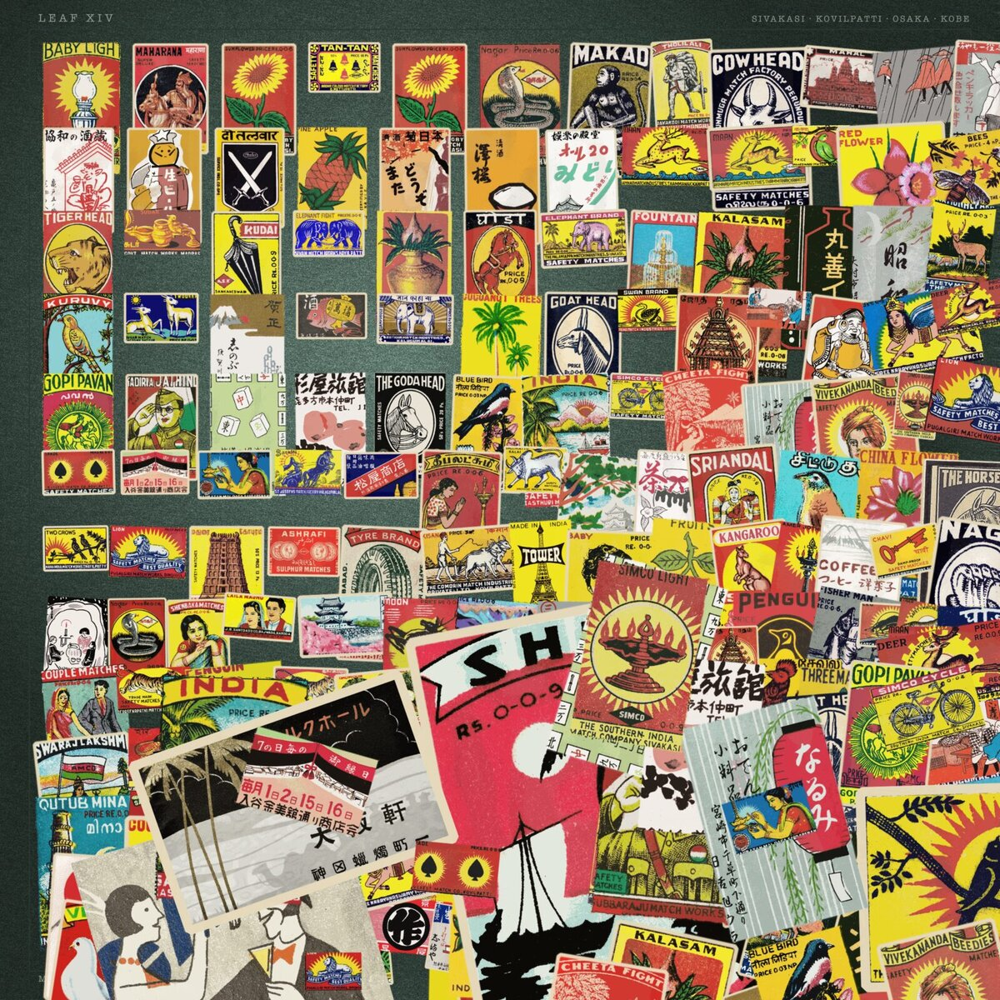
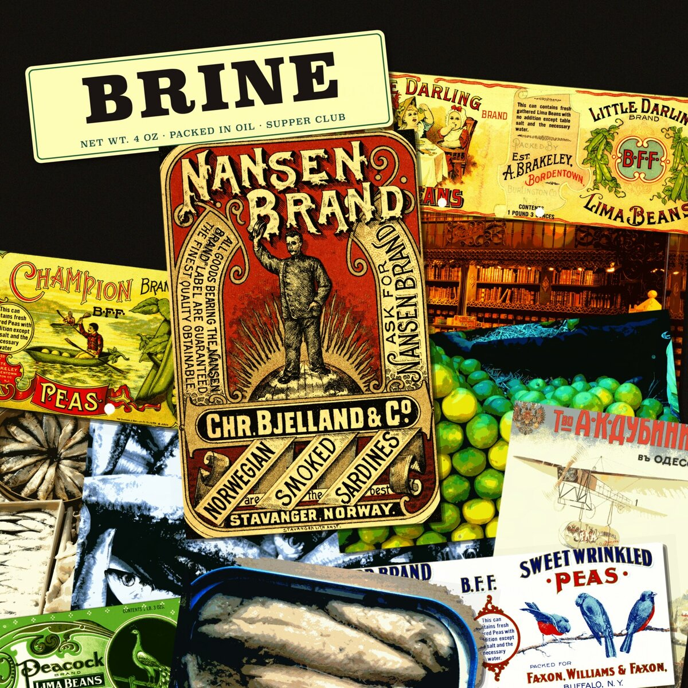
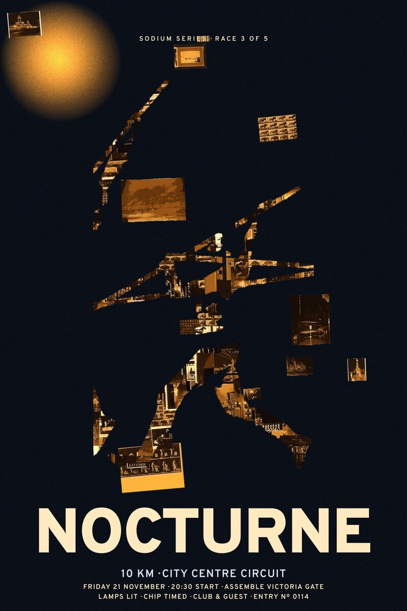
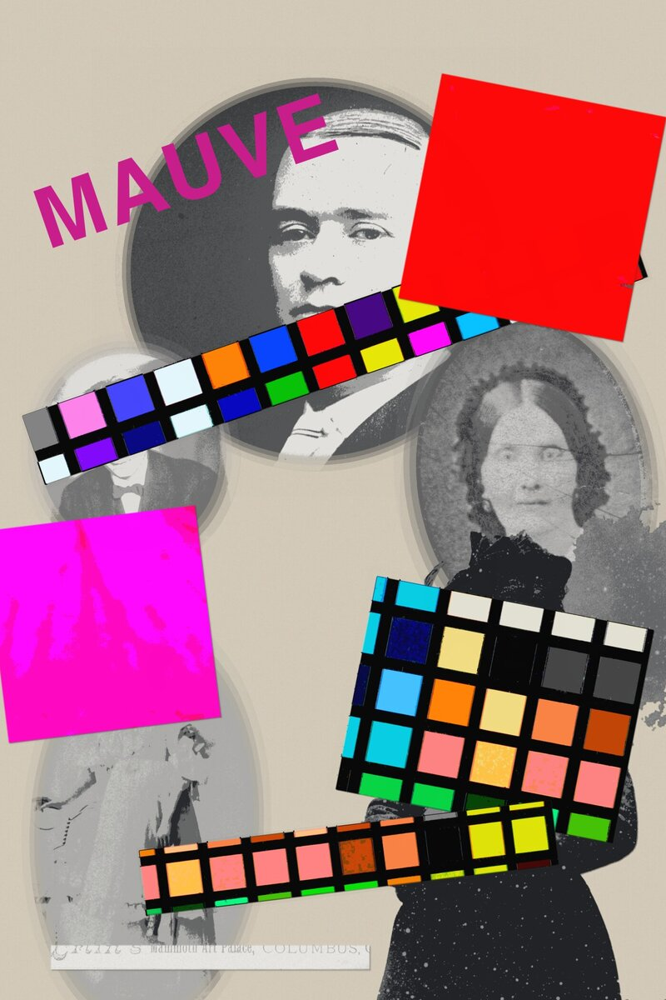

# collage-design

A Claude skill that makes **cut-and-layer collage**: it finds real, open-licensed photographs and
printed material, cuts them, unifies them into one palette, and composes a finished art piece as a
portable `.svg` plus its `.png`.

Everything in the result is sourced from real archives and logged with its licence, so the artwork
is safe to print, publish and sell.

## What it makes

Four pieces, each from the one sentence printed under it. Nothing here is generated imagery — every
fragment is a real scan from an open archive, cut and re-lit by the skill.

|  |  |
|:--|:--|
|  |  |
| **Strike Anywhere** — 244 fragments cut from 179 public-domain labels.<br>*"A square print for my kitchen made from old matchbox labels — hundreds of tiny loud pictures. I want it to feel like a collector's sheet that's got out of hand."* | **Brine** — three source families, cut three different ways, under one wet-varnish treatment.<br>*"Square cover art for a supper club called Brine. Sardine tins, market stalls, mid-century food packaging. Appetising and slightly grotesque."* |
|  |  |
| **Sodium** — the city cut into the runner's silhouette; poster furniture set in the same pass.<br>*"A tall poster for a running club's night race through the city. Bodies in motion, streetlights, sweat. Should feel like it's moving."* | **Mauve** — the unifying treatment deliberately overridden, so the seam stays visible.<br>*"A portrait poster where Victorian studio portraiture collides with present-day colour photography. Don't blend them — I want the seam to show."* |

Each run also writes the aesthetic movement it invented for the piece, the full source ledger, and
the build script that made it — see [What you get](#what-you-get).

## Install

**As a plugin** (recommended — updates in place):

```
/plugin marketplace add polgarp/collage-design
/plugin install collage-design@collage-design
```

**Or as a plain skill:**

```bash
git clone https://github.com/polgarp/collage-design.git ~/.claude/skills/collage-design
```

The skill runs its own dependency check at the start of every piece and prints the install line for
anything missing, so there's nothing else to set up. To check ahead of time, run
`scripts/check_deps.sh` from wherever you put it.

> **Claude Code only.** The pipeline shells out to ImageMagick, Inkscape and librsvg on your own
> machine, so it does not run on claude.ai or the desktop app.

## Use it

Just ask for the picture you want. You don't need to say "collage", and you don't need to name any
of the machinery — the four briefs above are the whole of what was typed to make those pieces.

Worth including if you have a view: **orientation and size**, the **mood**, and any **archive or
era** you want it drawn from. Worth mentioning **what the piece is for** - a book jacket, an album
cover, something you'll sell - because that decides which licences are acceptable, and it's easier
to settle before sourcing than after.

To use your own images, point at a folder: *"…use the scans in `~/Pictures/grandad-slides`."*
They can be mixed freely with sourced material.

**Asking for a series is much cheaper than asking for N pieces.** Sourcing dominates the cost, and
one pool feeds every piece in the set.

## Requirements

- **Real source imagery** — either web access, so it can pull from open-licensed archives, or a
  folder of your own you point it at. It works from both, and stops rather than inventing pictures
  if it has neither.
- **ImageMagick, Inkscape, librsvg, fontconfig, Python + Pillow + NumPy.** `check_deps.sh` prints
  the install line for anything missing. No ML dependencies.

## What to expect

- **20–40 minutes** for one piece, and roughly 100–150k tokens. Most of the wall time is sourcing,
  not compute.
- **Four to six render cycles.** Iteration is built in, so the first render is not the deliverable
  — if it looks assembled rather than made, that's the stage it's at, not a failure.
- **Disk:** up to ~540 MB of working intermediates for a large piece, plus 25–250 MB of sources.
- **Sourcing is deliberately rate-limited** to stay welcome at the archives it depends on. Don't
  raise it; going faster corrupts the pool rather than speeding it up. Local processing is
  parallel already.
- **A missing typeface stops the run** rather than silently substituting another face. Install the
  font, pick another, or set `COLLAGE_ALLOW_FONT_SUBSTITUTION=1` if you want it substituted.

## What you get

| | |
|---|---|
| `<piece>.svg` / `.png` | The artwork: self-contained SVG, and the shipping render |
| `philosophy.md` | The aesthetic movement invented for the piece — its register, edges, palette, and what reconciles the sources |
| `attributions.md` | Every asset with URL, creator and licence, and what those licences mean for reusing the result |
| `sources/` | Original downloads, unmodified |
| `build_*.py` | Parametric build script, so the piece can be edited rather than remade |

The `.svg` and `.png` are verified to be the same picture in any renderer, and fragment positions,
scales, palette and canvas size are named variables at the top of the build script — so you can
adjust a finished piece by changing a value and re-running, instead of starting over.

## Extending it

`cut.py` ships seven edge styles and `treat.py` five treatments, and both take a drop-in file with
your own parameters, so an invented style is a first-class citizen:

```bash
cut.py   --style-file my_edge.py  --param fade=0.45 in.jpg out.png   # def mask(w, h, p, rng)
treat.py --style-file my_treat.py --param warmth=0.6 in.png out.png  # def treat(rgb, p, rng)
cut.py   --sticker 16 treated.png sticker.png        # die-cut keyline following the silhouette
cut.py   --style torn --jobs 8 --manifest cuts.txt   # cut many fragments at once, across cores
```

`svgkit.py` handles embed-once, placement, renderer-safe shadows, text, and clipping fragments into
a container silhouette. It ships no layout presets — composition is invented per piece.

## Licensing

Apache 2.0 (`LICENSE.txt`). Derived from Anthropic's `canvas-design` — see `NOTICE.md`.

**Artwork you make with it is a separate question.** A collage is a derivative of every fragment in
it, so the most restrictive source sets the terms for the whole piece. The skill prefers public
domain / CC0, flags CC BY as needing credit, warns that **CC BY-SA is viral** and makes your
finished artwork copyleft, and treats CC ND as disqualifying. That reasoning ships in every
`attributions.md`.
